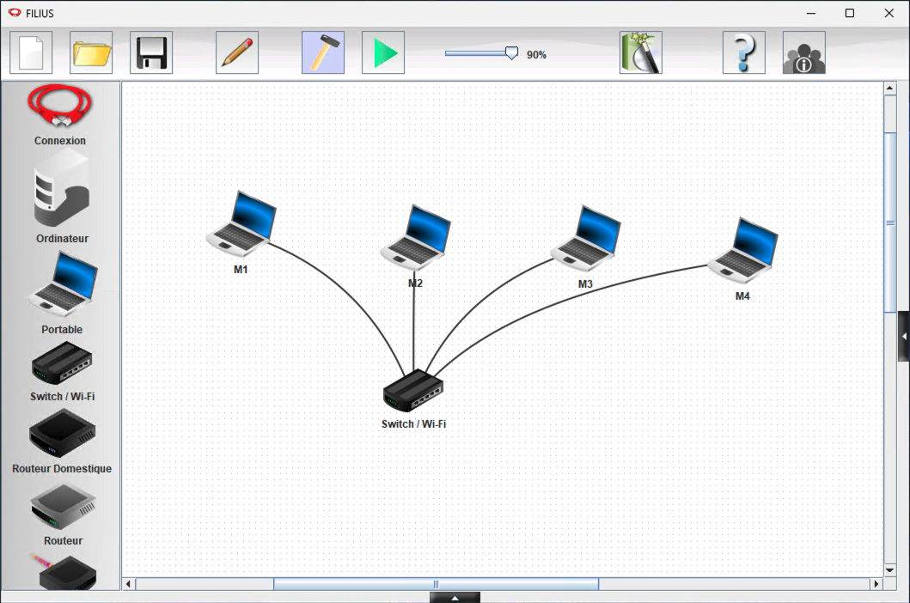
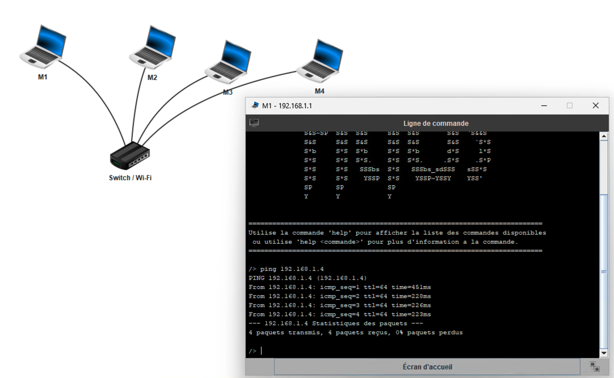
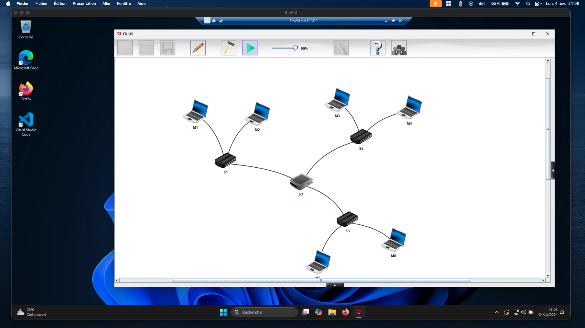
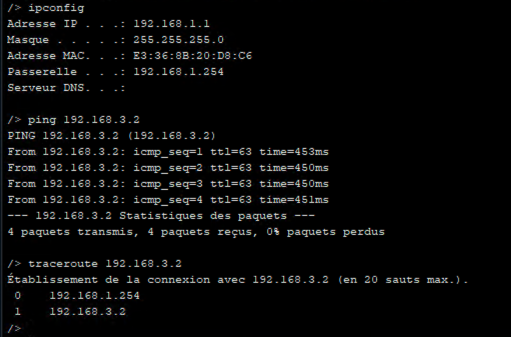
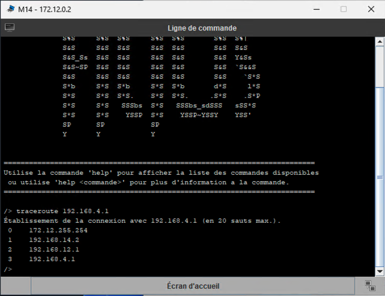
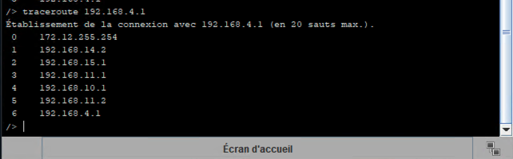

# Simulation réseau

## A faire vous même 1

## A faire vous même 2
Le fichier de sauvegarde est disponible [ici](AFVM2.fls)

## A faire vous même 3
Le traceroute entre la machine M14 & M9 :

La simulation de défaillance en retirant le cable entre le routeur F & E :

Je constate que la route qu'empruntais le trafic est maintenant indisponible, les routeurs empruntent maintenant une nouvelle route, même si elle est plus longue.